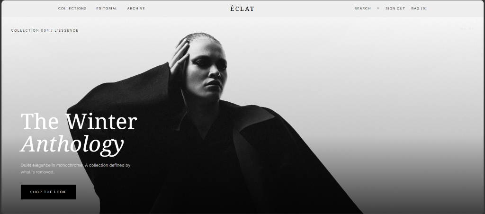

#  [ÉCLAT Storefront](https://eclat-storefront.vercel.app/) 

*A highly curated, minimalist, and ultra-premium e-commerce experience.*

ÉCLAT is a conceptual high-end fashion storefront built to deliver an immersive, magazine-like shopping experience. It prioritizes stunning visual aesthetics, micro-interactions, and a seamless checkout journey, paired with a robust administrative backend.

---



##  Features

- **Generative AI Storefront**: A dynamic, context-aware shopping experience powered by Google Gemini. The storefront intuitively adapts to user behavior, rendering intelligent product recommendations, conceptual tags, and curated editorial collections on the fly.
- **Natural Language & Semantic Search**: An ultra-smart search bar that goes beyond exact keyword matches. Users can search by vibe, occasion, or aesthetic (e.g., "monochrome winter coats" or "minimalist evening wear") to discover pieces perfectly aligned with their intent.
- **Editorial Design System**: A bespoke monochromatic UI inspired by high-fashion magazines. Features fluid typography (Noto Serif & Inter) and subtle glassmorphism to let the imagery take center stage.
- **Dynamic Product Interactions**: Intelligent hover states, auto-scrolling image carousels, and dwell-time tracking that feeds into the behavioral context engine.
- **Full Admin Dashboard**: Comprehensive internal tooling for managing products, inventory, sizes, and orchestrating editorial content.
- **Supabase Integration**: Secure authentication, real-time database management, and edge storage for high-resolution product imagery.
- **Optimized Cart Experience**: Slide-out cart with real-time stock validation and smooth quantity controls.
- **Responsive Architecture**: Flawless layout transitions from mobile to ultra-wide desktop displays.

##  Tech Stack

- **Framework**: [Next.js 16](https://nextjs.org/) (App Router & Turbopack)
- **Styling**: [Tailwind CSS v4](https://tailwindcss.com/) & Vanilla CSS Modules
- **Database & Auth**: [Supabase](https://supabase.com/)
- **State Management**: [Zustand](https://zustand-demo.pmnd.rs/)
- **AI & Search**: [Google Gemini API](https://deepmind.google/technologies/gemini/)
- **Validation**: [Zod](https://zod.dev/)
- **Deployment**: [Vercel](https://vercel.com)


##  Project Structure

```text
eclat-storefront/
├── storefront/
│   ├── src/
│   │   ├── actions/       # Server actions (cart, auth, admin)
│   │   ├── app/           # Next.js App Router pages & API routes
│   │   ├── components/    # Reusable UI components (eclat, admin, ui)
│   │   ├── context/       # React contexts (Behavior tracking)
│   │   ├── lib/           # Utility functions, Supabase clients, Mock data
│   │   └── store/         # Zustand global stores
│   ├── public/            # Static assets and placeholder images
│   └── supabase/          # Database schemas and migration scripts
```

##  Design Philosophy
ÉCLAT believes that e-commerce should feel less like a catalog and more like an exhibition. We use generous whitespace, constrained color palettes (`#f3f3f3` backgrounds), and deliberate typography choices to ensure the product imagery remains the absolute focal point.

---
*Built by [Adithya Upendran](https://github.com/adithyaupendran)*
